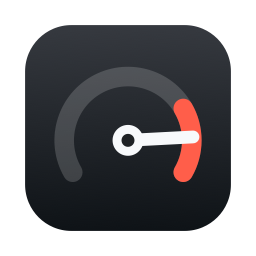
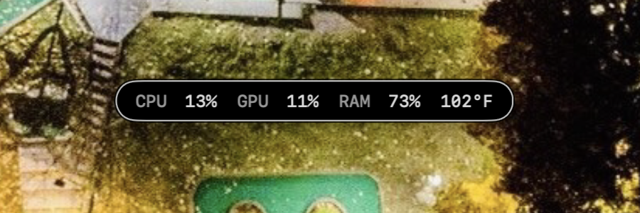
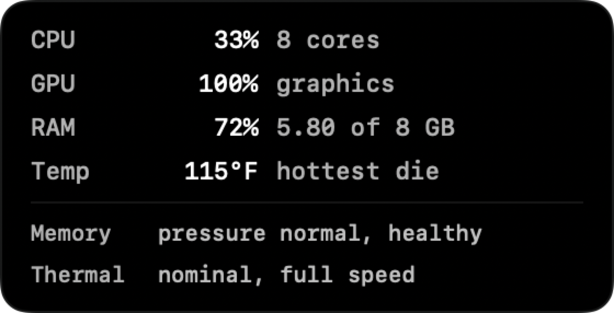

# Redline

**A free, open source system monitor for Apple Silicon Macs that tells you when
your Mac is throttling.**

CPU, GPU, memory usage and die temperature in one always-on-top pill you can
park anywhere on screen, plus a throttle warning the moment macOS reports
thermal pressure.



No dock icon, one menu bar item, about 1,000 lines of Swift. Builds with the
Xcode Command Line Tools alone, so you do not need a 12 GB Xcode install to
compile it.

Every number is padded to a fixed width in a monospaced face, so the pill holds
its size as the readings move. A monitor that jitters in the corner of your eye
is worse than no monitor.

## Install

```
brew install apeabody007/tap/redline
```

Then link it where you can launch it:

```
ln -sfn /opt/homebrew/opt/redline/Redline.app /Applications/Redline.app
open /Applications/Redline.app
```

Homebrew builds it from source on your machine rather than downloading a
binary. That is deliberate: locally compiled code is never quarantined by
Gatekeeper, so this needs no Developer ID certificate, and anyone who already
has Homebrew has the Command Line Tools it compiles with.

Or build it yourself from a clone:

```
./build.sh install
```

That builds `Redline.app`, copies it to `/Applications`, and launches it. Drag the
pill wherever you want it; the position is remembered.

Drag it anywhere, including up into the menu bar or down over the Dock, since
it draws above both. It is held to the left and right edges of the display so
the readings cannot be cut off, and it walks itself back onto a real screen if
the display it was living on gets unplugged.

Hover the pill for the detail panel: what the memory figure is actually made
of and what macOS makes of it, how many cores are behind the CPU number, and
what the thermal state means in plain words. It appears below the pill, or
above it when there is no room.



The menu bar item holds the rest:

- **Appearance** — Auto, Light or Dark. Auto follows the system.
- **Severity Colors** — values tint amber then red so the pill reads at a
  glance. CPU and GPU warm at 70% and go red at 90%. Memory is different: it
  tints by macOS's own pressure verdict, not by the percentage, because a Mac
  deliberately fills RAM with caches and compressed pages. 71% used can be
  perfectly healthy or can be thrashing, and the percentage alone cannot tell
  you which. Temperature ignores this toggle and always tracks thermal pressure.
- **Use Fahrenheit** — on by default, switch it off for Celsius.
- **Show HUD**, **Reset Position**, **Launch at Login**.

## Command line

```
redline --once       one reading, printed and exit
redline --sensors    every temperature sensor this Mac exposes
redline --help       usage
```

`--sensors` is the one to run on a new machine. If it prints readings, the
temperature display works there.

## Building

```
./build.sh           build into ./build
./build.sh install   build, copy to /Applications, launch it
./build.sh test      run the unit tests
./build.sh icon      redraw Resources/Redline.icns
```

Needs only the Xcode Command Line Tools. `tools/make-icon.swift` draws the app
icon in code, rendering each size natively rather than downsampling one master,
so it stays sharp at 16pt. `tools/preview-detail.swift` renders the hover panel
to a PNG, which is how its layout gets checked without running the app and
hovering it.

## How it reads the hardware

| Metric | Source | Portable |
| --- | --- | --- |
| CPU | `host_processor_info` tick deltas | Public API, stable |
| Memory | `host_statistics64`, matching Activity Monitor's "used" | Public API, stable |
| Memory pressure | `kern.memorystatus_vm_pressure_level` | Public sysctl, stable |
| GPU | IORegistry `IOAccelerator` → `Device Utilization %` | Documented key, present on Intel and every Apple Silicon generation so far |
| Thermal pressure | `ProcessInfo.thermalState` | Public API, stable |
| Die temperature | `IOHIDEventSystem`, resolved with `dlopen` | Private, best effort |

Only the last row is fragile. There is no public temperature API on Apple
Silicon and `powermetrics` needs root, so the symbols are looked up at runtime.
Nothing is hardcoded to a chip: Redline enumerates whatever sensors the machine
advertises on the temperature usage page, drops the battery, NAND, and
calibration sensors, and takes the hottest die reading that remains. On a Mac
where the lookup fails, the temperature is simply omitted and the throttle tag
carries the signal on its own.

That private lookup is also why this cannot ship on the Mac App Store, and why
the build is ad-hoc signed rather than notarized.

## Cost of leaving it running

About 0.4 CPU-seconds per minute idle, roughly 0.7% of one core, and 40 MB
resident. It opens no network sockets at all and only ever reads: kernel
counters, the IO registry, and the HID sensors. The only thing it writes is its
own preferences.

Sensor names are resolved once at startup rather than every tick, and the
peripheral sensors are filtered out at startup too, which cut idle CPU by 62%
over the naive version that walked all 39 services every second.

## Uninstall

If you installed with Homebrew:

```
brew uninstall redline
rm -f /Applications/Redline.app
```

If you built it from a clone:

```
rm -rf /Applications/Redline.app
```

Then, either way:

```
launchctl disable "gui/$(id -u)/dev.aaronpeabody.redline" 2>/dev/null
defaults delete dev.aaronpeabody.redline
```

The first of those two only matters if you turned on Launch at Login. The
second clears the remembered position and menu settings.

## Requirements

macOS 14 or later, Apple Silicon. Xcode Command Line Tools
(`xcode-select --install`).

## License

MIT
